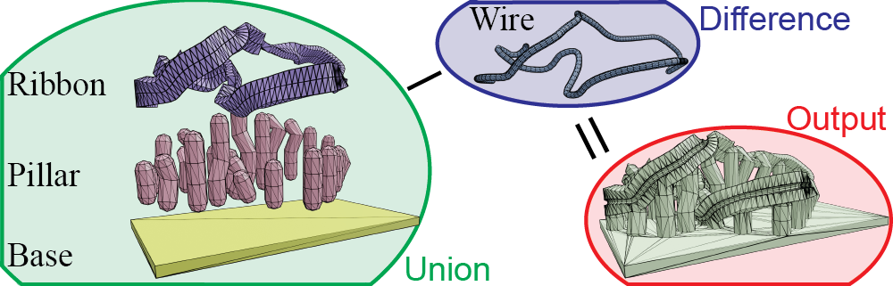

# Fabricable 3D Wire Art


This repository is the open-source implementation of the paper:

**Fabricable 3D Wire Art**\
[Kenji Tojo](https://kenji-tojo.github.io/), [Ariel Shamir](https://faculty.runi.ac.il/arik/site/index.asp), [Bernd Bickel](http://berndbickel.com/about-me), and [Nobuyuki Umetani](https://cgenglab.github.io/en/authors/admin/)\
In SIGGRAPH 2024\
**[[Project page](https://kenji-tojo.github.io/publications/fab3dwire/)]**

## WireGrad
<!--  -->


```wiregrad/``` contains our code for optimizing 3D wire shapes. The wire-shape optimization depends on our differentiable renderer and various regularization methods for 3D curves, which are also included in this project.

## WireJig
<!--  -->


```wirejig/``` contains our code for automatically generating 3D-printable jigs that assist in wire-art fabrication.

## Citation
```
@inproceedings{Tojo2024Wireart,
	title = {Fabricable 3D Wire Art},
	author = {Tojo, Kenji and Shamir, Ariel and Bickel, Bernd and Umetani, Nobuyuki},
	booktitle = {ACM SIGGRAPH 2024 Conference Proceedings},
	year = {2024},
	series = {SIGGRAPH '24}
}
```