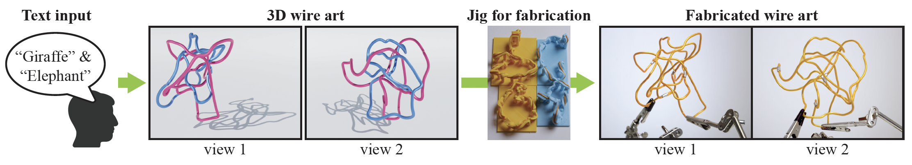

# Fabricable 3D Wire Art



This repository is the open-source implementation of the paper:

**Fabricable 3D Wire Art**\
[Kenji Tojo](https://kenji-tojo.github.io/), [Ariel Shamir](https://faculty.runi.ac.il/arik/site/index.asp), [Bernd Bickel](http://berndbickel.com/about-me), and [Nobuyuki Umetani](https://cgenglab.github.io/en/authors/admin/)\
In SIGGRAPH 2024\
**[[Paper](https://www.dropbox.com/scl/fi/pvvjthg9uir0sg16rvq2n/wireart_sig24.pdf?rlkey=ynzvq9t7ro9btbw8ejwfzjgzy&dl=0)]**


## Structure of this Repository
Our method has two parts, **wire-shape optimization** and **jig generation**, which are implemented respectively in ```wiregrad/``` and ```wirejig/``` directories.

## Citation
```
@inproceedings{Tojo2024Wireart,
	title = {Fabricable 3D Wire Art},
	author = {Tojo, Kenji and Shamir, Ariel and Bickel, Bernd and Umetani, Nobuyuki},
	booktitle = {ACM SIGGRAPH 2024 Conference Proceedings},
	year = {2024},
	series = {SIGGRAPH '24}
}
```